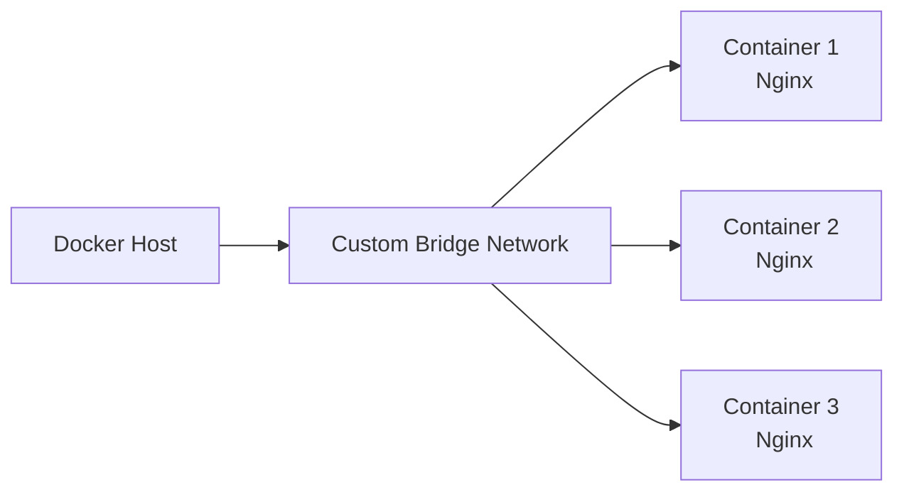

# 🌉 Mastering Docker Networking: Custom Bridge Network Communication 

[](https://github.com/TheToriqul/docker-custom-bridge-network)
[](https://github.com/TheToriqul/docker-custom-bridge-network/stargazers)


## 📋 Overview

In this hands-on project, I dive deep into the world of Docker networking, exploring how to establish seamless communication between containers using custom bridge networks. By leveraging the power of user-defined networks, I demonstrate how to create isolated environments, enable name resolution, and enhance security in multi-container setups. Through practical examples and step-by-step guides, I showcase my ability to architect and manage complex Docker network topologies.

## 🏗 Technical Architecture



## 💻 Technical Stack

- Containerization: 
- Web Server: 

## ⭐ Key Features

- Creation of a user-defined bridge network for granular control over container communication
- Launching multiple Nginx containers connected to the custom network
- Verification of seamless communication between containers using container names
- Isolated environment for enhanced security and ease of management
- Comprehensive guide on Docker network fundamentals and best practices

## 📝 Learning Objectives

Through this project, I aimed to:
1. Understand the benefits and use cases of user-defined bridge networks in Docker
2. Gain hands-on experience in creating and managing custom networks
3. Master the process of launching containers and connecting them to a specific network
4. Develop skills in troubleshooting and verifying container communication
5. Acquire knowledge of Docker networking best practices and architectural patterns

## 📚 Learning Journey

### Technical Mastery:
1. Advanced Docker networking concepts and configurations
2. Architecting scalable and secure multi-container environments
3. Leveraging user-defined networks for isolation and name resolution
4. Troubleshooting and monitoring container communication
5. Implementing best practices for Docker network design

### Professional Development:
1. Effective documentation and knowledge sharing through comprehensive READMEs
2. Problem-solving and debugging skills in complex containerized setups
3. Collaboration and communication in team environments
4. Continuous learning and staying up-to-date with Docker ecosystem advancements
5. Applying Docker networking principles to real-world scenarios

## 🔄 Future Enhancements

<details>
<summary>View Planned Improvements</summary>

1. Integration with Docker Compose for simplified multi-container orchestration
2. Exploration of overlay networks for multi-host communication
3. Implementation of network policies for fine-grained access control
4. Integration with service discovery and load balancing solutions
5. Performance optimization techniques for high-traffic scenarios
6. Security hardening measures for production-grade deployments

</details>

## ⚙️ Setup Guide

<details>
<summary>View Setup Details</summary>

### Prerequisites
- Docker installed on your local machine
- Basic understanding of Docker concepts and commands

### Steps
1. Clone the repository:
   ```
   git clone https://github.com/TheToriqul/docker-custom-bridge-network.git
   ```

2. Navigate to the project directory:
   ```
   cd docker-custom-bridge-network
   ```

3. Create the custom bridge network:
   ```
   docker network create --driver bridge my-bridge-network
   ```

4. Launch the Nginx containers:
   ```
   docker run -d --name container1 --network=my-bridge-network nginx
   docker run -d --name container2 --network=my-bridge-network nginx 
   docker run -d --name container3 --network=my-bridge-network nginx
   ```

5. Verify container communication by following the steps outlined in the [Communication Verification Guide](docs/communication-verification.md).

</details>

## 📖 Documentation

- [Architecture Overview](docs/architecture.md)
- [Communication Verification Guide](docs/communication-verification.md)
- [Troubleshooting Tips](docs/troubleshooting.md)
- [Best Practices](docs/best-practices.md)

## 📫 Contact

- 📧 Email: toriqul.int@gmail.com
- 📱 Phone: +65 8936 7705, +8801765 939006
- 🌐 LinkedIn: [linkedin.com/TheToriqul](https://www.linkedin.com/in/thetoriqul/)
- 🐙 GitHub: [github.com/TheToriqul](https://github.com/TheToriqul)
- 🌍 Portfolio: [thetoriqul.com](https://thetoriqul.com)

## 🔗 Project Links

- [GitHub Repository](https://github.com/TheToriqul/docker-custom-bridge-network)

## 👏 Acknowledgments

- [Poridhi for excellent labs](https://poridhi.io/)

Feel free to explore, modify, and build upon this configuration as part of my learning journey. You're also welcome to learn from it, and I wish you the best of luck!